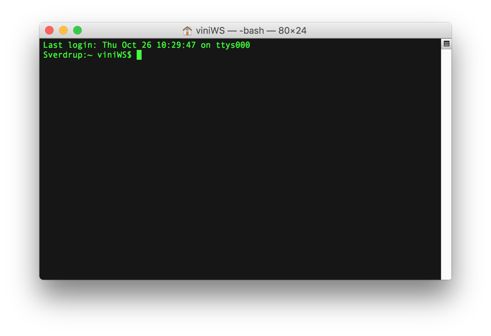
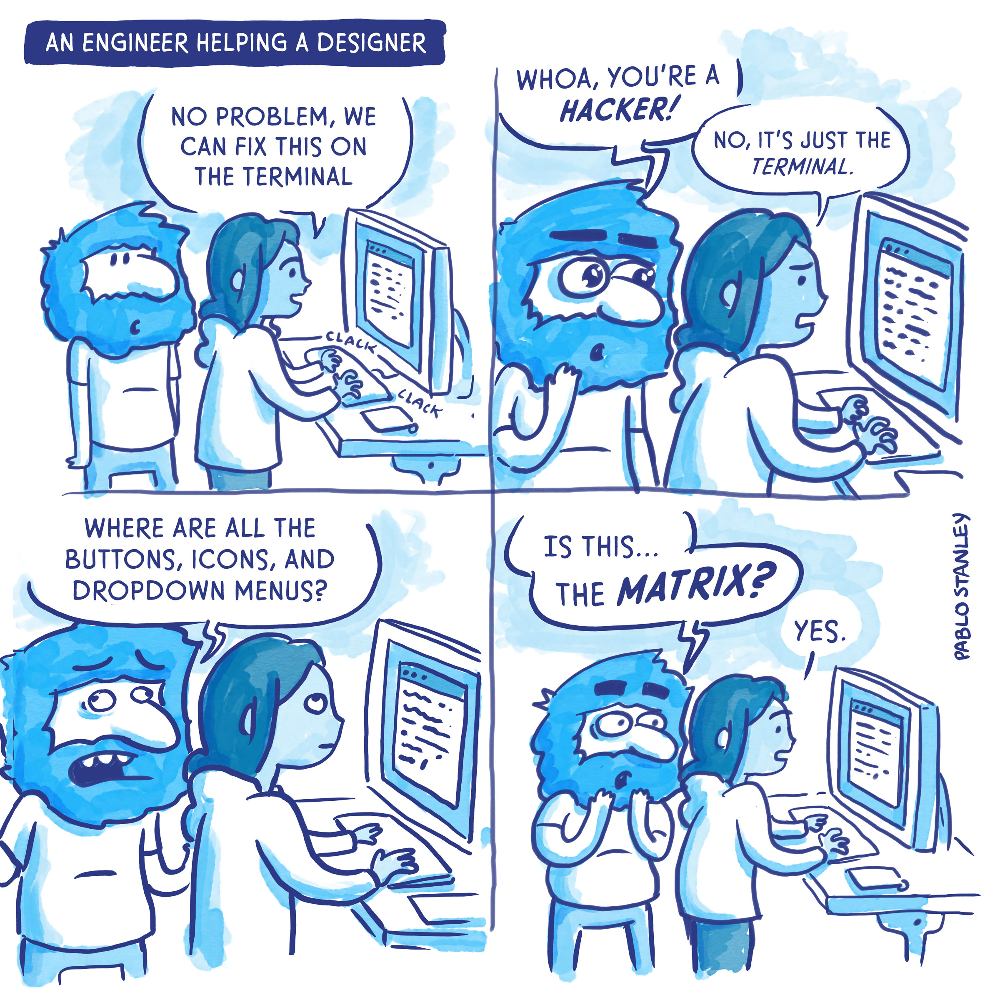
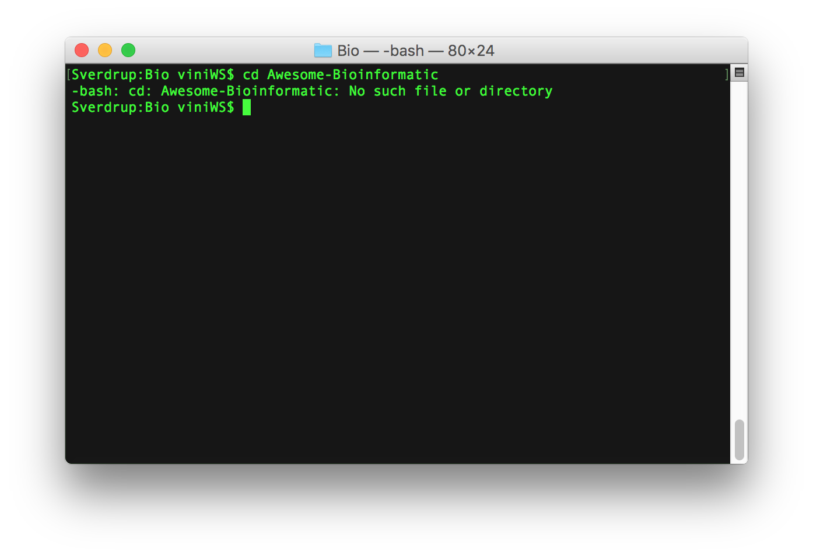
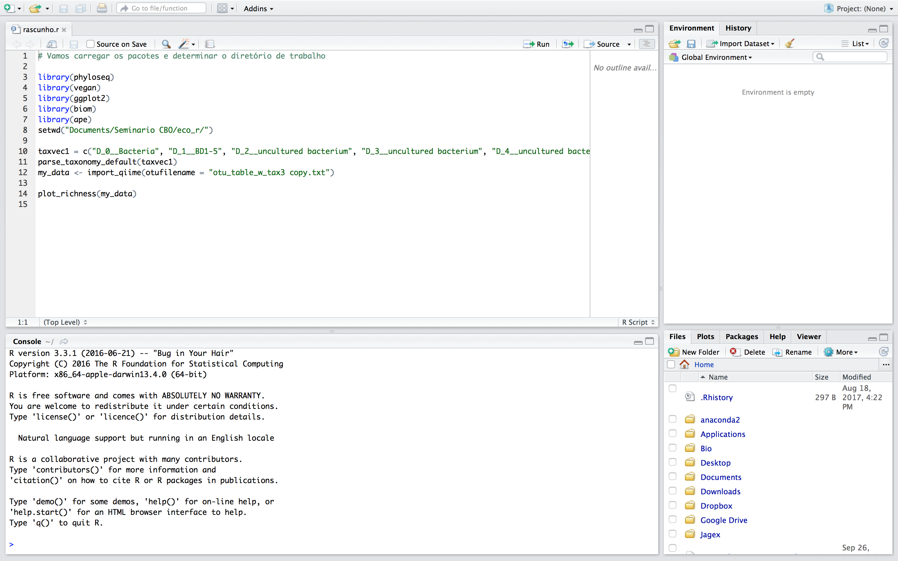

## Computação científica para biólogos e pesquisadores

### Sumário

[**Introdução: o porquê deste curso**](./introducao.md/)

I.1 Apresentação  
I.2 Informática cada vez mais necessária  
I.3 As ferramentas

[**Módulo 1: Ferramentas básicas**](./modulo_1.md)

1.1 - Linha de comando: Terminal  
1.2 - Editor de texto e IDE: Atom  
1.3 - Linguagem de Programação: Python

[**Módulo 2: Bibliotecas e ambientes virtuais**](./modulo_2.md)

2.1 - Conda: Ambientes virtuais e instalação de dependências  
2.2 - Bibliotecas essenciais: Pandas, Matplotlib e Jupyter  
2.3 - Analisando o conjunto Iris no Jupyter Notebook  

[**Módulo 3: Colaboração e boas práticas**](./modulo_3.md)

3.1 - Boas práticas em computação científica  
3.2 - Documentação e controle de versão: Git e GitHub  
3.3 - Como aprender programação: dicas para biólogos

-
## Módulo 1:

<!---

Recapitular intro
Layout no formato Ferramenta: program

-->

### 1.1 Linha de comando (CLI): bash e o Terminal

*"in the beginning, there was the command line."*  
Neal Stepherson

Links úteis

* [Software Carpentry: Shell Novice](http://swcarpentry.github.io/shell-novice/)
* [Learn Enough Command-Line to be Dangerous](https://www.learnenough.com/command-line-tutorial)
* [BioStar Handbook páginas 59-62](https://www.biostarhandbook.com/)

--

Pois bem, o famoso **Terminal**. Alguém aqui usa Linux? E Mac? Quem usa Windows? Conhecem o MS-DOS?

O Terminal será meramente nosso **aplicativo** para operar a nossa linha de comando (CLI), ou Unix (termos usados de forma intercambiada). Ele vem instalado de fábrica em sistemas Linux e Mac, que compartilham o fato de serem **sistemas operacionais tipo Unix** (*Unix-like OS*). Antigamente, eram operados primariamente pelo Terminal. (Usuários de Mac, sabiam disso? Já abriram Terminal? Já usaram?)

Quando aberto, o Terminal roda o programa **bash**, que é um tipo de *shell* (**Born Again SHell**). Vamos ver direitinho o que isso significa:  
**shell**, esse nome chama a atenção, certo? Shell é concha. Sim, exatamente. Quando operamos a linha de comando, estamos mandando instruções para o computador. Mas o computador não fala a mesma língua que a gente. **shell** é um programa que interpreta as informações digitadas e enviadas para o computador, que retorna o resultado; o processo complexo que acontece entre os dois passos é "escondido" dentro da "concha", por isso shell. O **bash** é o tipo mais comum de shell, empregado no Terminal.

Repare que no título da janela vemos o nome do usuário e o programa que o Terminal está rodando.

### É necessário aprender a linha de comando?

SIM. Se você quer aprender computação científica, você precisa entender os básicos de como é uma linha de comando. Ênfase no **básico**. É incrível a resistência para aprender a linha de comando por causa do seu aspecto de interface do 'Matrix'. Quando se vê um monte de letrinhas verdes em um fundo preto, já achamos que o sujeito está hackeando alguma coisa.

Para quem trabalha com *bioinformática*, algumas análises até podem ser realizadas sem o uso de uma CLI, mas o usuário será imensamente beneficiado ao utilizá-la. Não só isso, mas *compreender* Unix desenvolve um meio de pensar muito útil para resolver problemas bioinformáticos. [BioStar]

A verdade que a CLI é uma ferramenta essencial e apesar de que tem o potencial para ser muito complexa e poderosa, o biólogo "computeiro" só tem que saber o básico mesmo, e isso é **BEM** mais fácil do que parece!

Vamos ver um exemplo:

A pesquisa de Ana é com expressão de proteínas. Os arquivos de sequência são enormes! Quase 800mb para cada projeto. Eles ficam armazenados em um servidor dentro do laboratório. Ana quer dar uma  olhada e quem sabe correr umas análises em alguns projetos antigos, mas seu notebook Vaio de 2008 trava quando se tenta abrir um arquivo desse tamanho. Baixar cada projeto de 800mb vai dar bastante trabalho também.

Para Ana acessar esses arquivos, ela pode conectar-se ao servidor usando seu notebook, só que o sistema operacional não tem interface gráfica. É tudo pela linha de comando. Não é como se tivesse uma "tela" do usuário (uma GUI):

O servidor de Ana não parece com isso.

Mas Ana não se importa. Ela acessa e lê os arquivos, usa os programas que estão instalados, tudo usando a memória RAM do servidor. Seu notebook está rodando apenas o Terminal e suportando a conexão de rede até o servidor. Todo o resto acontece lá dentro da **shell** do servidor. **Ela nem precisou de um mouse.**

-

#### Primeiros passos - navegando

Vamos pensar no Terminal como um navegador de arquivos: o Finder no Mac ou o Explorer no Windows.

Abrimos o programa e nos encontramos na "Home" folder, ou seja, a pasta-mãe do usuário.

**Nota: O mais "correto" seria chamar as pastas de *diretórios*. Mas por questão de praticidade, qualquer um dos termos serve.**

No Terminal, acontece o mesmo. O padrão é abrir na "home folder".

Repare o título da janela, tem até a casinha.
Ok, mas onde está o conteúdo da pasta? Diferente da interface gráfica do Finder (explorer no Windows, nautilus no Gnome, etc.), preciso dizer para o Terminal, me mostre o conteúdo!

#### Agora quero que todo mundo pegue um papelzinho. Vamos anotar nossos comandos.

Alguns comandos do bash são ESSENCIAIS. É que nem quando você ensina a sua avó: olha vó, clica no ícone do Internet Explorer, aí clica na barrinha, etc. É o básico, e é muito fácil!

Nosso primeiro comando vai ser o `ls`, que significa "list", liste o conteúdo.

Estamos na Home folder, e com o `ls` visualizamos o conteúdo da pasta. Mas o arquivo que queremos não está aqui.

Enquanto no Finder teríamos que ir procurando e clicando nossa pasta de destino, no Terminal vamos digitar para onde vamos. Parece menos prático, certo? Não. Na verdade isso se torna bem mais rápido, especialmente em pastas com muuuitos arquivos.

Nosso segundo comando. Anota aí no papelzinho: `cd`

`cd` significa "Change directory". Ou seja, navegue para a pasta tal, assim como quando clicamos no nome da pasta no Finder. Logo, especificamos para qual pasta queremos ir. Vamos executar `cd Bio` para mudar para a pasta Bio e `ls` para ver o que temos lá. Não esquece que 'Bio' é com B maiúsculo, isso faz toda a diferença nos terminais.

Os dois programas estão fazendo a mesma coisa, navegando diretórios e visualizando seu conteúdo.

Do Terminal, queremos ir para a pasta 'Awesome-Bioinformatics'.
Executamos: `cd Awesome-Bioinformatic`

O bash retorna um erro de que essa pasta não existe. Claro, digitamos errado, faltou um 's' no final. A pasta Bio tinha um nome bem fácil de escrever, né? Essa já foi mais demorada. Agora imagina se quero digitar o nome de um arquivo chamado "resultados\_saidadecampo\_2703\_sem\_tabelas.txt", daria bastante trabalho, né? Eu podia até copiar e colar o nome do arquivo, mas isso também é chatinho.

**Vamos conhecer nossos dois melhores amigos em uma CLI!**

São eles: autocompleção e último comando, ou mais fácil, a tecla <kbd>TAB</kbd> e a seta pra cima <kbd>&uarr;</kbd>.

Posso acertar o comando anterior de duas formas: se escrevermos `cd A` e apertarmos <kbd>TAB</kbd>, o Terminal completa o nome corretamente, pois essa é a única pasta que começa com 'A'.

A segunda forma é usando a tecla <kbd>&uarr;</kbd>. Essa tecla digita o último comando executado, no caso `cd Awesome-Bioinformatic`. Aí só botamos o 's' no final, que vimos que estava errado, e pronto.

**Esses dois atalhos do teclado são ESSENCIAIS.** Eles vão facilitar muito a nossa vida e tornar o uso da CLI muito mais rápido.

Consertar o comando anterior = tecla <kbd>&uarr;</kbd>  
Completar nome de arquivo ou diretório = tecla <kbd>TAB</kbd>

Nosso terceiro comando será `pwd` = print working directory.

Ele vai nos dizer 'aonde', ou em qual pasta estamos.

Agora, vamos voltar para nossa Home. Quando usamos `cd` antes, especificamos nossa pasta de destino. Mas se digitarmos apenas `cd` e mais nada, automaticamente voltamos para Home.

Vemos que nosso diretório está contido dentro de /Users/. E se quisermos navegar para lá?
`cd Users` não funciona, pois Users não está dentro do diretório atual. Vamos tentar uma coisa: `ls -a`

`-a` é uma **opção** do comando `ls`. Significa "all", ou seja, listar todos os arquivos. Além do conteúdo que vemos normalmente, a interface exibe os arquivos ocultos, ou do sistema, que começam com .

Repare que temos um arquivo `.` Isso! ponto mesmo. E outro chamado `..`
Estes arquivos correspondem ao diretório **atual** e ao diretório **superior**, ou seja, o que contém nosso diretório atual.  
`cd ..` Navegamos para a pasta Users, que contém a pasta Home.  
`cd ..` Novamente e agora estamos na pasta `root`, `/` ou raíz.

Vamos dar uma olhada no que aprendemos agora.

`ls` nos mostrava o que tinha no diretório atual.  
`pwd` mostrava qual é o diretório atual.  
`cd Bio` para navegar para uma pasta específica, `cd` para Home.  
`ls -a` listava os arquivos, com a opção ativada de mostrar todos.  
Nos exemplos acima, além dos comandos em si, temos **argumentos** (pasta de destino) e **opções** ou parâmetros (`-a`). Um único comando pode receber variados argumentos ou parâmetros, por exemplo: `ls -a ..` vai listar todos os arquivos do diretório que contém o diretório atual.

Com esse pouquinho já conseguimos navegar no nosso computador. Existem várias formas de usar `ls`, `cd` e tal, e podemos consultar isso.

Nosso quarto comando, `man`, de manual, abre uma página explicativa do comando que botamos como argumento.  
`man ls` exibe o manual do comando `ls`, as opções existentes, etc.
Repare que enquanto estamos nessa página, o Terminal não aceita novas instruções. Essa é uma observação importante. Qualquer CLI tem o que chamamos de *prompt*. O *prompt* é um caracter que indica que a nossa CLI está pronto para receber novos comandos *input*. No caso do bash, nosso *prompt* é representado pelo caracter **$**. Quando estamos na página do manual, o *prompt* não aparece.
Para sairmos, apertamos <kbd>q</kbd> (quit).

Outras situações podem nos deixar "presos" em uma operação do Terminal. Digite `cat` (vamos ver o que esse comando faz em outro momento). O *prompt* sumiu, certo? Para interromper essa ação, podemos usar o <kbd>CTRL</kbd> + <kbd>C</kbd>. Sempre que estivermos travados, o <kbd>CTRL</kbd> + <kbd>C</kbd> interrompe a operação e retorna ao *prompt*.

Esse gato ficou preso, ele podia só apertar <kbd>CTRL</kbd> + <kbd>C</kbd>.

Agora que já sabemos interromper um comando **e** sair da página do manual, dê uma lida na página do manual dos seguintes comandos:

* `mkdir`
* `rm`
* `cp`
* `mv`

Esses são mais alguns comandos de pastas. `mkdir <nome do diretório>` cria um diretório com o nome do argumento que lhe é passado. `rm` serve para deletar arquivos (`rm <nome do arquivo>`). `cp` e `mv` servem, respectivamente, para copiar e mover arquivos e pastas. São usados da seguinte forma:  
`cp <arquivo ou diretório a ser copiado> <novo destino>`

Vamos exemplificar:

`cd Desktop`  
`mkdir leite`  
`mkdir cereal`  
`mv leite cereal` Pessoal, sempre coloquem o leite no cereal e nunca o contrário.
`rm cereal` retorna um erro.
Precisamos digitar:  
`rm -r cereal` o -r é para "**recursivo**", ou seja, o comando deleta cada coisa dentro da pasta e depois a pasta em si.

Com esses comandos, já conseguimos navegar, criar, copiar, mover e deletar pastas. Também vimos o que são opções, o que são argumentos e o que é o *prompt* de uma CLI. Aprendemos a usar a autocompleção com <kbd>TAB</kbd> e como acessar os comandos anteriores.

Você ainda deve estar se perguntando porque fazer tudo isso dessa forma quando usar a interface gráfica é bem mais fácil. Obviamente, o bash oferece **muito** mais do que isso, e algumas coisas só são possíveis com ele, como o exemplo que demos mais cedo com o caso de Ana. Ela acessa o servidor remoto usando o Terminal, usa os comandos `ls`, `cd`, `mv` para visualizar, navegar e manipular os arquivos e muito mais. Vamos ver um exemplo de uma aplicação mais avançada de bash que seria muito mais difícil de fazer manualmente. 

Digamos que eu quero achar **TODOS** os .mp3 no meu computador e botá-los em uma pasta única chamada MeusMP3s, dentro da pasta Volumes. O comando que faz isso seria:  
`find / -name "*.mp3" -exec cp {} /Volumes/MeusMP3s \;`

É um comando um pouco mais avançado mas ainda assim são alguns segundos digitando vs. horas procurando pelos MP3s e clicando. Observe bem o comando: ele busca (`find`) na raíz (todo o computador) (`/`) arquivos de nome `"*.mp3"` e executa um `cp` para a pasta desejada. Repare no asterisco. Isso é o que chamamos de *wildcard*, ou coringa. Dizer "*.mp3" é o mesmo que dizer "qualquer combinação de caracteres que acabem com .mp3". Se eu executo um `cp * pastadedestino`, vou copiar todos os itens do diretório atual para a pastadedestino. Se eu executo `cp *.txt pastadedestino`, vou copiar todos os itens que tenham extensão .txt para a pastadedestino, e assim em diante.

Por mais que no começo tudo isso pareça um monte de informação, a medida que vamos usando no nosso dia-a-dia, vai se tornando algo cada vez mais fácil e rápido. Para motivos práticos, só é preciso saber um basicão de **bash** para poder fazer várias coisas bem importantes. Agora que vimos um pouco dessa ferramenta, vamos para a próxima ferramenta: o **editor de texto**.

<!---
To do 1.1:

Terminal para r e Python
Linkar referências do texto aos links do início da seção

-->

-

### 1.2 Editor de texto e IDE: nossa bancada de laboratório digital

Links úteis

* [Flight Manual](https://flight-manual.atom.io/)
* [Learn About Text Editors in Five Minutes or Less](https://learntocodewith.me/programming/basics/text-editors/)
* [Setting up a Python Development Environment in Atom](https://www.youtube.com/watch?v=DjEuROpsvp4)

 
**Quando você começar a codar, vai perceber que vai passar muito tempo no editor de texto. Então fique confortável com ele.**

O bom e velho NotePad: um editor de texto é, simplesmente, um programa que visualiza e edita *plain text files*, ou seja, arquivos que são apenas texto. Alguns exemplos são .txt, .csv, .html, e muitos outros. Como dissemos na Introdução do curso, diferente de um *processador de palavras*, como o Word, um editor de texto *não se preocupa com formatação*, e visualiza o conteúdo dos arquivos diretamente como está gravada, sem formatação.

O nosso principal uso do editor de texto será o de escrita e registro dos nossos *scripts*, ou código. Além disso, será usado para visualizar outros scripts, arquivos de texto, arquivos *tab-delimited* contendo tabelas, etcetera.  

O Atom foi nossa escolha por diversos motivos:

* É grátis, *open source* e completamente configurável/customizável
* Variedade de pacotes e *plugins* (precisaremos deles)
* Baseado na web e em páginas da web [1]
* Multi-plataforma
* Foi criado por desenvolvedores para desenvolvedores
* Tem suporte total do [GitHub](https://github.com/)
* Você também pode contribuir futuramente com seu *plugin*

No final, você pode usar o editor de texto que quiser, e existem algumas alternativas, nem todas grátis, como o [SublimeText](https://www.sublimetext.com/) ou o [Microsoft Visual Studio Code](https://code.visualstudio.com/). Cada um vai ver o que prefere, eu particularmente acabei escolhendo o Atom, mas na sua jornada de informática você vai descobrir se prefere outro. As *features* essenciais que qualquer editor de texto deve ter são [2]:

* Fácil de usar
* Opção *Find and replace*
* Cortar, copiar e colar
* Aceita texto em UTF-8
* Customizável e extensível
* Possui *syntax highlighting*

Essas funções são as mais imprescindíveis para ter um bom domínio sobre nossos arquivos. A desvantagem de editores bem completos como os listados acima, quando comparados com os mais básicos como o Bloco de Notas, o TextEdit ou o **nano**, é que podem ser meio lentos.

### IDE: Integrated Development Environment

O Atom não vai servir apenas como editor de texto. O fato dele ser altamente customizável significa que existem diversos plugins, entre eles o `platformio-ide-terminal`.

Vamos usar esse plugin para **integrar** o Terminal, nossa ferramenta de linha de comando, ao Atom, nosso editor de texto. Isso vai nos fornecer um **IDE**, abreviação para *Integrated Development Environment*. Nosso IDE será bem rudimentar, mas já serve bem ao nosso propósito.

**Mas afinal, o que é e para que serve um IDE?**

O IDE, como o nome diz, é um ambiente integrado de desenvolvimento. Ele serve para escrever código (programar), bem como executar esse código, testá-lo, organizar os arquivos do projeto, entre outras funções.

Um bom exemplo de IDE é o [RStudio.](https://www.rstudio.com/) [Quem aqui já ouviu falar?]

Enquanto o programa 'R' é apenas uma *linha de comando* dessa linguagem, o RStudio é um IDE para programação em R. Na imagem acima, podemos ver como o painel na parte de baixo a esquerda é igual ao que vemos quando abrimos o programa 'R' (uma linha de comando da linguagem). Apesar de que no 'R' também conseguimos escrever um script, o RStudio facilita essa tarefa (olhe o script sendo escrito no painel acima e a esquerda), e providencia outras ferramentas para otimizar o processo de programação (como oferecer acesso aos arquivos do projeto, abaixo a direita na imagem).

Como o RStudio serve quase que exclusivamente para programação em R, vamos improvisar nosso IDE customizado usando o Atom e o Terminal. Isso mesmo, já estamos hackeando programas! Olha só.

A instalação do plugin que queremos é simples: no menu de Settings do Atom, vamos em Install, procuramos por 'terminal' e no `platformio-ide-terminal` clicamos em instalar.

Para abrir uma instância do Terminal, clicamos na cruz no canto inferior da tela.

Repare bem na imagem abaixo. A esquerda, temos um fácil acesso aos nossos arquivos do projeto. No centro temos uma janela de editor de texto com um pouco de código, e na porção de baixo, temos uma janela com o Terminal, nossa linha de comando.

**Além disso, é colorido e bonitinho.** 

Uma coisa que chama a atenção de pessoas leigas em programação são as telas com código colorido. Isso se chama *syntax highlighting*, e é uma propriedade muito útil da IDE. Vamos supôr que estamos trabalhando em um script em Python ou R. Esses scripts terminam com extensões .py e .r, respectivamente. Como nosso editor oferece suporte a essas linguagens, ele reconhece o que cada pedaço do código significa, por isso as diferentes cores. Veremos mais sobre isso na seção de introdução ao Python.

O que vamos fazer aqui é enviar os comandos da porção do editor de texto para a janela do Terminal, otimizando nosso processo de programação, assim como acontece no RStudio. O código é escrito **no editor de texto** para que seja registrado, e apertando <kbd>CTRL</kbd> + <kbd>Enter</kbd>, a linha de código é executada no Terminal. Seria muito inconveniente ter que ficar copiando e colando cada comando entre dois aplicativos diferentes.

**Outra vantagem é, podemos usar esse formato para diversas linguagens, e não só para o R**, e também temos acesso ao Terminal. É importante destacar que apesar do padrão para o Terminal ser o *bash*, podemos rodar outras linguagens nele.

		

Abrindo instâncias de Python e R no Terminal. Repare na barra no topo da janela.

### 1.3 Python: simples, poderosa e popular

Referências:

[[1]](papers/Ekmekci 2016 Introduction to programming for bioscientists.pdf) **Ekmekci et al, 2016.** An Introduction to Programming for Bioscientists: A Python-Based Primer.

[Na introdução](./introdução.md#Vivemos na era digital e da informação), comentamos o fato de que cientistas precisam lidar com análise de dados, e isso já implica a necessidade de aprender o básico de programação. Uma linguagem muito boa para esse propósito é o R, e por conta disso que, pelo menos no Brasil, ela costuma ser a que os biólogos tem o primeiro contato. Outros exemplos são o [MATLAB](https://www.mathworks.com/products/matlab.html) ou programas como Primer e Statistica. No entanto, estes exemplos (incluindo o R) são voltados para manipulação, visualização e análise de dados, e podem ser um pouco restritos para outros usos.

A linguagem Python foi originalmente criada para ["propósitos diversos"](https://pt.wikipedia.org/wiki/Linguagem_de_programa%C3%A7%C3%A3o_para_prop%C3%B3sitos_diversos), e costumava ser utilizada principalmente para desenvolvimento web, [em sites como YouTube e Spotify.](https://www.shuup.com/blog/25-of-the-most-popular-python-and-django-websites/) No entanto, a criação de bibliotecas como [NumPy](http://www.numpy.org/), [Pandas](https://pandas.pydata.org/) e [Matplotlib](https://matplotlib.org/) tornaram essa linguagem tão útil para análise de dados quanto as citadas anteriormente. Atualmente, [é a quarta linguagem mais popular do mundo](https://www.tiobe.com/tiobe-index/).

Porém, o que torna o Python ideal para nós, além de sua versatilidade e popularidade, é o fato de que **é uma linguagem muito amigável para iniciantes**, prezando pela simplicidade e legibilidade do código. Em um paper da PLoS Computational Biology [[1]](papers/Ekmekci 2016 Introduction to programming for bioscientists.pdf), Ekmekci e colaboradores argumentam que é a melhor linguagem para biocientistas por conta de três motivos:

- semântica direta e sintaxe simples a tornam uma primeira linguagem prontamente acessível;
- é uma linguagem de alto nível e orientada a objetos;
- a diversidade de bibliotecas e pacotes extende sua funcionalidade a virtualmente todos os campos das ciências biológicas.

	

O [Zen do Python](https://www.python.org/dev/peps/pep-0020/) descreve a filosofia da linguagem: simplicidade e praticidade.

Na nossa IDE, você pode abrir uma instância de Python digitando `python` no console. No arquivo [Python - primeiros comandos.html](Python - Primeiros comandos.html) temos alguns exemplos bem básicos. Experimente abrir o console e testar comandos similares.

### Aprendendo Python na internet

Como o foco do nosso curso não aprender Python, e sim boas práticas de programação, é importante apontar que existe uma abundância de recursos para aprender a linguagem gratuitamente na internet. Os materiais em português são mais restritos, disponíveis principalmente como livros. Além do paper de Ekmekci et al. citado acima, aqui estão alguns outros recursos:

* [Codecademy Learn Python](https://www.codecademy.com/learn/learn-python) - site que oferece cursos gratuitos de uma variedade de linguagens de programação.
* [DataCamp Intro to Python for Data Science](https://www.datacamp.com/courses/intro-to-python-for-data-science) - uma introdução voltada à análise de dados. Muito útil para cientistas aprendendo a primeira linguagem.
* [Introduction to Programming with Python](http://opentechschool.github.io/python-beginners/en/index.html) - site com curso introdutório gratuito na forma de eBook.
* [A Byte of Python](https://www.gitbook.com/book/swaroopch/byte-of-python/details) - eBook gratuito com uma introdução bem completa.
* [Data Analysis in Python](http://www.data-analysis-in-python.org/) - Site com tutorial bem completo voltado à análise de dados
* [Python for Biologists](https://pythonforbiologists.com/introduction/) - esse site oferece um tutorial básico direcionado para biólogos que é gratuito, e também uma variedade de cursos mais avançados.
* [Learn Python the Hard Way](https://learnpythonthehardway.org/book/) - um eBook bem completo cuja introdução é gratuita.
* [Rosalind](http://rosalind.info/problems/locations/) - Rosalind é um projeto de educação de bioinformática que contém uma seção voltada para exercícios em Python.

Recursos em português:

* [Automatize tarefas maçantes com Python - Al Sweigart](https://www.livrariacultura.com.br/p/livros/informatica-e-tecnologia/programacao/automatize-tarefas-macantes-com-python-15076373) - Livro que introduz a linguagem com o propósito de resolver tarefas digitais do dia-a-dia.
* [Introdução à programação com Python - Nilo Ney Coutinho Menezes](https://www.livrariacultura.com.br/p/livros/informatica-e-tecnologia/programacao/introducao-a-programacao-com-python-42273748) - Excelente livro que ensina príncipios de lógica de programação utilizando Python como primeira linguagem.

Além destes, existe mais uma infinidade de sites, blogs, canais do YouTube que oferecem conteúdo de qualidade. Recomendamos que o leitor escolha um recurso com o qual se sinta confortável e busque aprender o básico da linguagem. 

Linguagens de programação são como idiomas: para tornar-se fluente, leva tempo, prática e imersão. No entanto, em uma tarde é possível aprender algumas frases básicas só "sobreviver". A medida que compreendemos o funcionamento da sintaxe, o aprendizado vai se tornando mais fácil.

Em um post no fórum [Reddit](https://www.reddit.com/), o usuário [u/twopi](https://www.reddit.com/user/twopi) faz um [comentário](https://www.reddit.com/r/learnprogramming/comments/75xrpj/im_in_a_code_school_im_beginning_to_suspect_that/do9w710/) bem perspicaz.
Se não puder ler na íntegra, o que ele explica é o seguinte (adaptado):

"Basicamente, o começo do aprendizado em programação se resume em dois componentes:
	
- O que é que estou tentando realizar?	
- Como que faço isto?

A primeira parte é MUITO mais difícil do que a segunda, e nenhum Google vai ajudar. Para isso é necessário pensar em algoritmos, ou seja, pegar o problema que você quer resolver e transformá-lo em uma lista de passos bem definidos, precisos e discretos. Para isso, não importa que linguagem você vai utilizar, você pode até escrever em português. Você sabe que terminou essa etapa quando você sabe que cada passo que você escreveu pode ser convertido em código. Você NÃO precisa saber COMO converter! Você precisa entender os conceitos de programação para saber quão a fundo você precisa ir.

Uma vez que você sabe exatamente o que você está tentando fazer, você passa por cada linha de algoritmo e descobre como fazer aquilo na linguagem que você está utilizando. **Essa parte é fácil, e é aonde você pode usar o Google o StackOverflow.**  (...)"

Vamos retomar isso no Módulo 3, mas a lição aqui é de que se sabemos **o que queremos realizar**, **como** faze-lo é mais fácil.

-

### Conclusão do Módulo 1

Muito bem, já progredimos um bocado no nosso curso e cobrimos três ferramentas essenciais para o biólogo programador:  
1. A **linha de comando**. Aprendemos como usar o **Terminal** e o que é a linguagem *bash*.  
2.  O **editor de texto**. Integramos o **Atom** ao nosso **Terminal** e improvisamos uma **IDE**: nossa bancada de laboratório no computador.  
3. Uma **linguagem de programação**: Vimos as vantagens de aprender a linguagem **Python** e uma variedade de recursos para aprende-la na internet. Também vimos alguns comandos básicos no arquivo [Python - primeiros comandos.html](Python - Primeiros comandos.html).
