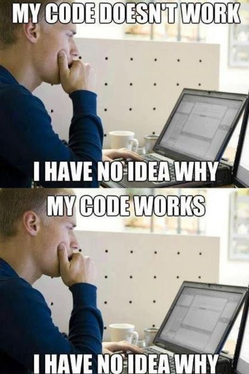

## Computação científica para biólogos

### Sumário

[**Introdução: o porquê deste curso**](./Introdução.html/)

I.1 Apresentação  
I.2 Informática cada vez mais necessária  
I.3 As ferramentas

[**Módulo 1: Ferramentas básicas**](./Módulo 1.html)

1.1 - Linha de comando: Terminal  
1.2 - Editor de texto e IDE: Atom	
1.3 - Linguagem de Programação: Python

[**Módulo 2: Bibliotecas e ambientes virtuais**](./Módulo 2.html)

2.1 - Conda: Ambientes virtuais e instalação de dependências  
2.2 - Bibliotecas essenciais: Jupyter, Pandas e Matplotlib.  
2.3 - Analisando o conjunto Iris no Jupyter Notebook  

[**Módulo 3: Colaboração e boas práticas**](./Módulo 3.html)

3.1 - Boas práticas em computação científica  
3.2 - Documentação e controle de versão: Git e GitHub  
3.3 - Como aprender programação: dicas para biólogos

-

## Módulo 3:

### 3.1 - Boas práticas em computação científica
 
Nos Módulos 1 e 2 já fomos introduzidos à uma variedade de ferramentas que serão essenciais no nosso caminho da informática. Conseguimos fazer análise e visualização do conjunto de dados "Iris" usando comandos Python, no nosso Jupyter Notebook ou na nossa interface Atom + Terminal. Vimos diversos recursos para aprender a linguagem, como baixar e instalar bibliotecas e como organiza-las em ambientes virtuais; para integrar todos esses conhecimentos, temos que nos concentrar em adotar **boas práticas de computação científica**.

Através de suas experiências com os workshops da *Software Carpentry*, Greg Wilson e colegas [[1]](./papers/Wilson et al 2017 Good enough practices scientific computing.pdf) destacaram a carência dessas práticas e elaboraram um sumário de regras gerais que cientistas podem e devem considerar adotar. O título do paper, "Práticas boas o suficiente em computação científica" (adaptado) já faz alusão ao fato de que o exercício de tais práticas não deve ser algo cansativo e perfeccionista, mas sim princípios básicos no qual devemos nos apoiar na hora de trabalhar no computador, **da mesma forma que fazemos na bancada**. 

Isso significa que *workflows* computacionais devem seguir as mesmas práticas que outros projetos de laboratório, incluindo dados organizados, passos documentos e uma estruturação do projeto voltada à *reprodutibilidade*. Se usamos métodos computacionais para manipular nossos dados, eles devem ser descritos na literatura; A regra geral é sempre citar os softwares que foram utilizados, especialmente se há um paper descrevendo a ferramenta. No entanto, assim como um protocolo de laboratório, o processamento de dados pode variar dependendo de como a ferramenta computacional é utilizada. Imagine um ensaio enzimático: a concentração de determinado reagente pode influenciar o resultado final, certo? O mesmo acontece com ferramentas de informática: A configuração de determinados parâmetros em um software pode alterar a saída de dados, e consequentemente a informação a ser interpretada. Portanto, não basta citar apenas o método utilizado, e também **como** foi utilizado.

O paper de Wilson et al., fornece um guia detalhado, porém simples, de como essas práticas proporcionam um "controle de qualidade" no processo de pesquisa, visando facilitar a execução pelo próprio usuário e também garantindo sua reprodutibilidade para terceiros. Hoje em dia, é muito fácil se perder na montanha de dados e análises de qualquer projeto, por mais singelo que seja, logo fica a dica da leitura para qualquer pesquisador no século XXI. Suas recomendações se dividem nos seguintes tópicos:

* **Gerenciamento de dados *(data management)*:** salvar ambos dados originais ("*raw*") e intermediários, documentar todos os passos, criar dados limpos compatíveis com a análise.
* ***Software:*** escrever, organizar e compartilhar *scripts* e programas usados em uma análise.
* **Colaboração:** facilitar para que colaboradores existentes e novos como entender e contribuir para um projeto.
* **Organização de projeto:** organizar os artefatos digitais de um projeto de forma a facilitar sua descoberta e entendimento.
* **Monitoramento de mudanças:** registrar como os diversos componentes de seu projeto mudam ao longo do tempo.

(adaptação livre do artigo)

### 3.2 - Documentação e controle de versão: Git e GitHub.

Como já foi discutido, para garantir o rigor científico de uma análise, é necessário documentar todos os passos. Assim como na ciência precisamos descrever nossa metodologia, quando estamos programando precisamos documentar nosso código. O que isso significa é que devemos explicar como nosso programa funciona, o que cada linha de código faz e como utilizar funções. Fazemos isso através de **comentários.**

Nos Jupyter Notebooks deste curso já vimos comentários. São linhas de código precedidas de algum caracter (em Python, `#` ou blocos de textos entre os caracteres `'''` ou `" " "` que servem para iniciar e fechar tais blocos de comentários).

Imagina se formos ter que usar aquele mesmo código daqui há 6 meses? Será que a gente vai entender o que cada coisa faz? Por isso é importante adicionar comentários à medida que um arquivo de código vai acumulando linhas. Quando escrevemos programas mais complexos, a documentação não se refere somente aos comentários, mas a um conjunto de documentos que vão auxiliar usuários e desenvolvedores daquele programa. Arquivos como "README.txt", "requirements.txt" ou "LICENSE.txt" são exemplos de documentos. Documentação é um aspecto fundamental para a prática de programação, no entanto no momento podemos nos contentar com adicionar comentários úteis em nossos humildes scripts.

Uma análise realizada através de código pode ser documentada da mesma forma que um programa que já foi desenvolvido. Por exemplo, [nessa página](https://github.com/vinisalazar/BioEnergia-Lagoa/blob/master/Lagoa%20BioEnergy%20Project%2016S%20Analysis%20Workflow.md) temos um *workflow* para análise de uma comunidade microbiana a partir de amplificação e sequenciamento do gene rRNA 16S. O arquivo é do tipo .md (MarkDown), ou seja, um arquivo de texto contendo os comandos executados no Terminal utilizando os pacotes PEAR e QIIME. Repare como as versões de cada pacote, bem como a base de dados de referência (SILVA), foi referenciada. Cada comando (ou passo do protocolo) é precedido de uma explicação e aparece exatamente como foi digitado.

Apesar de ser o suficiente para reproduzir a análise, esse documento falha em um aspecto, que é o de não *printar* o *output* de cada comando. Como já foi visto conseguimos fazer isso no Jupyter Notebook! Podemos mesclar texto em MarkDown, código com os devidos comentários e ainda podemos visualizar o output, como fizemos com o conjunto Iris!

A prática de documentação de forma distinta para cada uma dos cinco tópicos de boas práticas propostos por Greg Wilson. Nossa próxima prática importante será a de usar um programa de **controle de versão.**


Todos nós já passamos por aquela situação de ter vários arquivos parecidos com nomes do tipo "rascunho.doc", que viram "versaofinal.doc", depois "v\_final2.doc", "v\_finalcorrigida.doc", "vfinal\_agora_vai.doc"

**Git** é um VCS, ou *version control s programa que monitora as mudanças em nossos projetos, e permite criar *checkpoints* em nossos arquivos e diretórios. Basicamente, nosso trabalho envolve os seguintes passos:

* Criar coisas
* Salvar coisas
* Editar coisas
* Salvar a coisa de novo

No quarto passo, salvar novamente, que controle de versão irá nos auxiliar. Podemos registrar **o que foi alterado**, **quando** aconteceu a mudança, e comparar o **antes** e **depois.**


Dessa forma, gerenciamos as versões do nosso projeto, como se tirássemos pequenos retratos (*snapshots*) de cada versão do projeto.

Para ter uma ideia melhor de como o Git funciona, [siga o tutorial no site (em inglês).](https://try.github.io/levels/1/challenges/1)

Apesar de vermos como funciona no site, é interessante fazer uma demonstração local na nossa máquina. Primeiro, [certifique-se que você tem o Git instalado.](https://git-scm.com/book/en/v2/Getting-Started-Installing-Git) Vamos criar um diretório, inicializar o Git nesse diretório, criar um arquivo de texto, adiciona-lo ao nosso arquivo Git, e realizar um *commit*, ou seja, registrar a mudança que realizamos no nosso projeto.

<!-- Módulo 3 - git.ipynb -->


A vantagem do Git é o fato de ser totalmente integrado com o [**GitHub**](https://github.com/). Esse site é uma plataforma extremamente popular de **compartilhamento de código**, aonde usuários e organizações mantém **repositórios**, pastas contendo projetos que podem ser *clonados*, *forkeados*, e no geral compartilhados entre usuários. Assim como esse tutorial que você está lendo é mantido no GitHub, você pode (e deve) fazer upload dos seus projetos para lá. Diferente de outras plataformas em nuvem, como Dropbox ou Google Drive, o GitHub é voltado especificamente para projetos de código, sejam programas, aplicativos, bibliotecas, *scripts*, e muito mais. Existe uma infinidade de recursos para aprender como o GitHub funciona, como o [guia Hello World!](https://guides.github.com/activities/hello-world/) do próprio site, ou, em português, [esse vídeo](https://www.youtube.com/watch?v=UMhskLXJuq4) e este [post de blog.](http://gabsferreira.com/criando-e-enviando-arquivos-para-seu-repositorio-no-github/) Dê uma olhada para entender a integração entre o VCS que é o Git e a plataforma que é o GitHub.

### 3.3 Como aprender programação: dicas para biólogos


Nosso curso já nos muniu de ferramentas essenciais para trilharmos o caminho da informática. Para encerrar, vamos ver algumas dicas importantes que vão além de programas ou plataformas. Recente, os pesquisadores Maureen Carey e Jason Papin publicaram um guia curto intitulado "Dez regras simples para biólogos aprendendo a programar" [[2]](papers/Carey & Papin 2018 Ten Simple Rules.pdf). Fizemos uma tradução e adaptação livre do guia para nos apoiarmos.

**Regra 1: Comece com o final em mente**

Quando for escolher uma linguagem, foque no seu objetivo. Você quer se tornar um programador? Você quer implementar ferramentas bioinformáticas? Você quer só analisar logo esses dados? Escolha um *approach* e uma linguagem que se adeque ao seus objetivos de curto e longo prazo.

**Regra 2: Passos de bebê são passos**

Uma vez que você começou a fazer o que precisa, se concentre em uma tarefa de cada vez e aplique suas habilidades de pensamento crítico e solução de problemas. Descontrua um problema grande em pequenos passos objetivos e resolva as tarefas uma a uma.

**Regra 3: Imersão é a melhor ferramenta de aprendizado**

Não "costure" uma análise trocando diferentes ambientes/linguagens. Quando se está aprendendo, se uma tarefa pode ser feita toda em um único ambiente ou linguagem, faça tudo lá. Como o comentário do usuário twopi que vimos no Módulo 1 (1.3), linguagens de programação são como idiomas, e imersão é a melhor forma de as aprender.

**Regra 4: Ligue para um amigo**

Existem numerosos recursos onlines: tutoriais (como este!), documentação e websites de Q&A, no entanto nada substitui a ajuda de um amigo ou colega. Encontre uma comunidade de programadores, que inclua usuários iniciantes e experientes, para procurar ajuda. Peça ajuda para descontruir e interpretar código, leia o código dos outros, tentando entender cada linha. Discuta bem suas perguntas, peça por correções em seu código.

**Regra 5: Aprenda como fazer perguntas**

Existe uma resposta para quase tudo online, mas você precisa saber o que perguntar para conseguir ajuda. Para isso, você precisa entender o problema. **Tente interpretrar as mensagens de erro, identifique cada componente da mensagem e como ele indica onde está o erro.** Entender o problema é essencial, e esse processo que se chama *debugging*. Vários sites oferecem [referências de como fazer suas perguntas](https://codereview.stackexchange.com/help/how-to-ask), então siga essas instruções para conseguir ajuda de form mais efetiva.

**Regra 6: Não reinvente a roda**

A regra 6 é encontrada em outras "listas de regras para biólogos" ([uma](http://journals.plos.org/ploscompbiol/article?id=10.1371/journal.pcbi.1002802), [duas](http://journals.plos.org/ploscompbiol/article?id=10.1371/journal.pcbi.1005128), [três](http://journals.plos.org/ploscompbiol/article?id=10.1371/journal.pcbi.1003244) e [quatro](http://journals.plos.org/ploscompbiol/article?id=10.1371/journal.pcbi.1000358)). Use todos os recursos disponíveis para você! Tutoriais online, documentação das linguagens, código publicado, pedacinhos de código interessantes que alguém compartilhou e os seu próprio trabalho. Leia bastante para identificar esses recursos, dê os créditos apropriados. Documente bem seu código para que você consiga aproveita-lo em trabalhos futuros e possa poupar tempo.

**Regra 7: Desenvolva bons hábitos desde cedo**

Pesquisa computacional é pesquisa, então utilize *boas práticas*. Isso inclui manter um caderno de laboratório computacional [[3]](papers/Schnell 2015 Ten Simple Rules for a Computational Biologist's Laboratory Notebook.pdf), que deve incluir protocolos. Protocolos computacionais são scripts ou métodos, e devem incluir o código em si e como acessar tudo para implementar o código, *garantindo a reprodutibilidade*. Isso também envolve controle de versão para garantir a manutenção dos protocolos e cadernos.

**Regra 8: prática leva à perfeição**

Use conjuntos de dados (*datasets*) simples para praticar um problema ou análise. Como fizemos com o Iris dataset, use conjuntos pequenos e fáceis que permitam prever os resultados, mas que possuam a mesma estrutura dos seus dados. Teste sua análise usando esses conjuntos de dados como controle negativo.

**Regra 9: Ensina a si mesmo**

Assim como devemos fazer quando vamos ensinar alguém, devemos ser generosos com a paciência e empatia quando ensinamos a nós mesmos. Você não está sozinho em sua frustração ocasional. Aprender leva tempo, então planeja de acordo. Explora teus recursos e planeja teu aprendizado, sempre avaliando teu progresso.

**Regra 10: *Just do it***

Só começe a codar. Você não consegue editar uma página em branco.

--

Partindo do que foi exposto nesse guia, podemos frisar alguns pontos:

#### Assim como na bancada, faça uso de boas práticas
Recapitulando a regra 7, desde cedo devemos adotar boas práticas! Este tutorial que você está lendo foi desenvolvido com esse fim. Uma boa referência para isso é o paper de Wilson et al [[1]](../papers/Wilson et al 2017 Good enough practices scientific computing.pdf). 

É importante manter nossa máquina organizada. Quando você começar a programar, vai se encontrar baixando muitos pacotes, bibliotecas e afins, bem como criando pastas para seus projetos. Como o Terminal costuma abrir na *home folder*, uma sugestão é criar um diretório nela que vai conter todos estes tais pacotes e ferramentas de terceiros (*third-party software*) que você vai acabar precisando. A partir daí, você pode botar seus projetos próprios e repositórios de GitHub nessa mesma pasta ou em uma segunda (e até terceira) pasta separada. Se você estiver usando o ```conda``` como gerenciador de pacotes, a pasta "Anaconda" em sua *home folder* contém seus ambientes e suas respectivas bibliotecas, no entanto de qualquer forma criar uma pasta para abrigar outro software que não seja do Anaconda.

Para nossos diretórios de projeto, devemos adotar um layout de organização de pastas que funcione para nós. Por exemplo o diretório principal é ```pibic_fulano```, descrevendo de forma simples sobre o que se trata. Nele, temos um diretório ```data``` para os dados, um ```img```para imagens, um ```scripts``` para o código que foi escrito ou utilizado, um ```relatorio``` com os arquivos do relatório PIBIC em markdown, em um arquivo README em .txt ou .md dando mais detalhes sobre o conteúdo do repositório. Vamos reproduzir esse padrão para diretórios similares. Em cada um deles, é interessante criar um arquivo Git (com o comando ```git init```) e eventualmente fazer upload para o GitHub, o que também garante um backup em nuvem! **Backups são importantes**. Recomenda-se três fontes de backup, sendo que uma deve ser em nuvem (GitHub, Google Drive, Dropbox), e as outras podem ser, por exemplo, seu computador e um HD externo ou flash drive. Usando o Git ou outras ferramentas. é possível manter todas as fontes sincronizadas entre si.

Wilson et al. também recomendam o seguinte protocolo para lidar com arquivos contendo dados:  

1. Salve os dados "crus" (*raw data*), **exatamente como foram coletados**.
2. Faça backup destes.
3. Crie "*analysis-friendly data*, ou seja, dados que sejam compatíveis com o software que será usado para analisá-lo. Isso pode envolver editar cabeçotes, converter formatos de arquivo e afins, e vai facilitar que você execute o passo 4.
4. Crie os dados que quer ver no mundo. Figuras, gráficos, tabelas ou como você desejar apresentar seus dados.  
5. Registre todos os passos usados para processar os dados. Isso pode ser feito em um Jupyter Notebook, devidamente anotado como mencionado na **Regra 7**, acima. No exemplo do diretório ```pibic_fulano```, poderíamos ter mais uma pasta chamada ```analysis``` com arquivos .ipynb descrevendo as análises com os dados da pasta ```data``` e o software da pasta ```scripts```, bem como eventuais comentários.

Para arquivos contendo software, podemos aproveitar mais algumas dicas deste guia:  

1. Bote um breve comentário explicativo no início de todo programa/script/código.
2. Decomponha programas em funções.
3. Seja impiedoso com duplicações e redundâncias.
4. Sempre procure por bibliotecas de software bem mantidas e atuais que podem fazer o que você precisa.
5. Teste bibliotecas antes de confiar nelas.
6. Dê nomes significativos para variáveis e funções.
7. Explicite dependências e requerimentos para correr sua análise.
8. Dê datasets de exemplo.

Se refira ao paper e também à seção 3.1 para ver outras dicas nos tópicos de **gestão de dados**, **gestão de software**, **colaborações**, **organização de projeto**, **monitoramento de mudanças** e **redação de manuscritos.**

#### Não tenha medo de errar
Essa dica se refere às **Regras 5 e 10**. Em programação, é muito comum encontrar mensagens de erro. Na verdade, elas nos ajudam! Começamos recebendo uma mensagem de erro e nem sabemos por que. Parando para a ler, conseguimos descobrir QUAL é o problema para tentar resolve-lo. As vezes mudamos uma coisinha e obtemos um erro diferente.



Apesar da **Regra 4**, o melhor amigo do programador será o [Google](https://www.google.com), onde podemos malandramente copiar e colar nossas mensagens de erro e esperar que alguém que já teve o mesmo problema tenha conseguido resolver. Certo? Não exatamente. Como mencionado na **Regra 5**, devemos fazer bem nossas pesquisas, e se necessário, perguntar em sites como o [Stack OverFlow](https://stackoverflow.com/), explicitando nosso problema e dando exemplos conforme o adequado.

](../img/stackover.png)

#### Aprenda inglês
Essa é uma recomendação tão geral que deve valer para qualquer pessoa que queira trabalhar como pesquisador. Assim como na ciência, na programação e informática o inglês é de longe o idioma predominante, seja para tutoriais, documentação, nome de programas, tipos de dados e variáveis. Também é o mais difundido em fóruns de programação, livros, periódicos e os mais diversos tipos de recursos. Uma das motivações para criar esse tutorial que você está lendo foi justamente a carência de materiais em língua portuguesa. Embora existam bons recursos para aprender programação, principalmente no [YouTube](https://www.youtube.com/) e em blogs, são poucos os que estão voltados à **computação científica** em si.

### Conclusão do Módulo 3.

Chegamos ao fim do nosso conteúdo! Vamos fazer um sumário geral e recapitular o que aprendemos.

* Na [**Introdução**](../Introdução.html/) exploramos a importância de aprender informática e o porquê deste curso, e também fomos apresentados ao que será ensinado.
* No [**Módulo 1**](../Módulo 1.html/), aprendemos os básicos de três ferramentas essenciais:
	1. Terminal: Ter um *prompt* de comando (CLI) nos permite executar funções do sistema (*bash*), bem como um console para diferentes linguagens de programação, como Python e R.
	2. Atom: utilizart um editor de texto permite o registro, visualização e modificação do nosso código. Acoplar nosso editor de texto ao Terminal fornece uma **IDE** simples, que pode servir para desenvolvimento, análises ou testes.
	3. Python: compreender e dominar uma linguagem de programação permite entender seu propósito, como programas nela escritos funcionam, e como escrever código utilizando a dita linguagem. Python é uma linguagem poderosa, versátil e popular, o que a torna muito indicada para iniciantes.
* No [**Módulo 2**](../Módulo 2.html), aprendemos sobre gerenciadores de pacotes como o ```conda```, e também como baixar e instalar bibliotecas do [Anaconda Cloud](https://anaconda.org/) ou do [PyPI](https://pypi.python.org/pypi), utilizando `pip`. Criamos um ambiente com as bibliotecas Pandas, Matplotlib e Jupyter, que são bibliotecas populares de Python que permitem análise e visualização de dados (Pandas e Matplotlib) e um ambiente integrado de execução e documentação de código (Jupyter). Fizemos uso dessas biliotecas para importar e visualizar o Iris dataset.
* No [**Módulo 3**](../Módulo 3.html), discutimos o que são boas práticas de computação científica [[1]](papers/Carey & Papin 2018 Ten Simple Rules.pdf), tivemos uma demonstração de controle de versão e o que é e para que serve o GitHub. Vimos um guia de dez regras simples para biólogos aprendendo a programar [[2]](../papers/Carey & Papin 2018 Ten Simple Rules.pdf), e outras dicas.

#### Da onde seguir daqui

Explore as referências!

Faça um curso de Python!

Crie uma pasta com um conjunto de dados que você tenha. Tente escrever código que processe os seus dados de alguma forma. Inicialize o Git no diretório. Se você ainda não tem uma conta no GitHub, crie uma e faça upload do seu repositório.

**Referências:**
   
[[1]](../papers/Wilson et al 2017 Good enough practices scientific computing.pdf) **Wilson et al, 2017.** Good enough practices in scientific computing.  
[[2]](../papers/Carey & Papin 2018 Ten Simple Rules.pdf) **Carey & Papin, 2018.** Ten simple rules for biologists learning to program.  
[[3]](../papers/Schnell 2015 Ten Simple Rules for a Computational Biologist's Laboratory Notebook.pdf) **Schnell, 2015.** Ten simple rules for a computational biologist's laboratory notebook.
