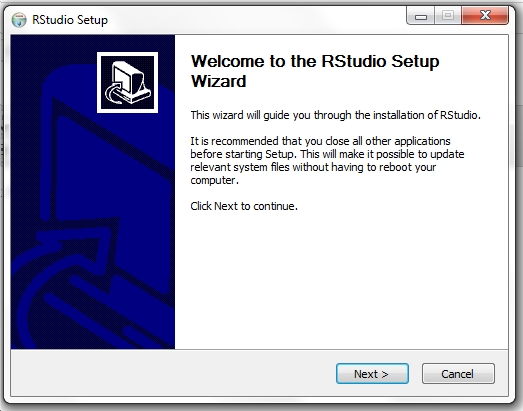

## Curso de boas práticas computacionais para biólogos: Sobrevivendo na era digital

### Sumário

**Introdução:**

- [I.1 Apresentação](### I.1 - Introdução)  
- [I.2 Informática cada vez mais necessária](### I.2 Quem não aprender isso, provavelmente vai ficar para trás...)  
	- [I.2 Nota sobre a **bio**informática](###[Nota sobre a bioinformática])   
- [I.3 Boas práticas computacionais e reprodutibilidade](### I.3 Macaco vê, macaco faz)  
- [I.4 As ferramentas](### I.4 Ferramentas básicas da computação científica)

**Módulo 1:**

[1.1 - Command-line interface (CLI): bash e o Terminal](### 1.1 Linha de comando: bash e o Terminal)	
[1.2 - Editor de texto e IDE](### 1.2 Editor de texto e IDE: nossa bancada de laboratório digital)	
1.3 - Python: 

**Módulo 2:**

2.1 - Conda: Ambientes virtuais e instalação de dependências  
2.2 - Bibliotecas essenciais: Jupyter, Pandas e Matplotlib.  
2.3 - Usar o ambiente criado e repositório clonado para análise de dados

**Módulo 3:**

3.1 - Controle de versão: Git e GitHub  
3.2 - Documentação e boas práticas em computação científica  
3.3 - Os desafios de aprender programação e como lidar com erros  

-

## Módulo 2:

### 2.1 Conda: ambientes virtuais e dependências

### Pacotes e bibliotecas

Assim como o R, a capacidade do Python é enormemente expandida por conta da grande quantidade de pacotes e bibliotecas disponíveis. Alguns são essenciais para quem quer realizar análise de dados.

.

[Nesse tópico no site BioStars](https://www.biostars.org/p/50749/#50758), esse usuário apontou algumas ferramentas em Python que são úteis para biólogos.

Logo, é imprescindível aprender a baixar, instalar e rodar esses pacotes. Essa instalação é simples, mas é diferente de usar um "Install Wizard": geralmente é feita pela linha de comando.

Você pode até se safar instalando o RStudio usando um Install Wizard, mas para instalação de pacotes Python vai ter que recorrer ao Terminal.

Além disso, existe outra questão: muitos pacotes dependem de outros para funcionar, e todos dependem de ter uma instância de Python instalada. Pior, às vezes pacotes requerem versões **específicas** de outro pacote ou linguagem, e pacotes que requerem versões **diferentes** podem causar o que chamamos de um **conflito de dependência**. 